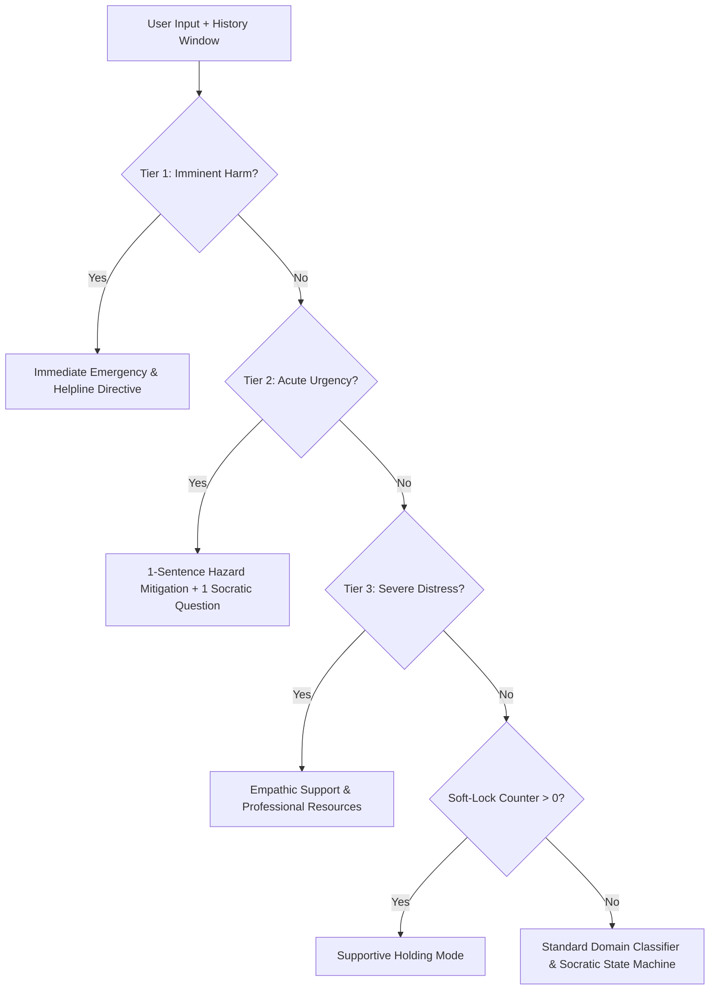

# Urgency vs Crisis Triage Architecture

**One Job:** Specify the 3-tier triage state machine, sliding-window detection algorithms, soft-lock re-entry mechanics, and PII minimization protocols.

---

## 1. 3-Tier Priority Taxonomy

The system enforces a strict hierarchical precedence during utterance evaluation:

$$\text{Imminent Harm} \succ \text{Acute Urgency} \succ \text{Distress} \succ \text{Domain Socratic}$$

### Tier Definitions
1. **Tier 1 — Imminent Harm:**
   - *Scope:* Immediate threat to human life or self-harm (*"want to die tonight"*, *"ending it all now"*, *"suicide tonight"*).
   - *Action:* Block Socratic engine. Issue empathic validation + generic nearest emergency services directive + local 24/7 crisis support. Set `crisis_lock_turns = 2`. Zero hardcoded phone numbers at runtime to prevent VPN/geographic misdirection.
2. **Tier 2 — Acute Urgency:**
   - *Scope:* Immediate physical damage or pending irreversible data disaster (*"leak on ceiling above PC and it will get wet right now!!!"*, *"sparking electrical outlet"*, *"pending accidental rm -rf prod without backup"*).
   - *Action:* Deliver a 1-sentence physical/data mitigation directive (power down/unplug/move, stop writes/snapshot) followed by 1 clean Socratic question (<60 words total).
3. **Tier 3 — Severe Distress:**
   - *Scope:* Chronic burnout, hopelessness, acute relationship breakdown (*"burned out, hopeless, tank is empty"*, *"wife leaving me and I can't take this"*).
   - *Action:* Deliver empathic validation + recommendation to engage trusted human support / local professional services. Set `crisis_lock_turns = 2`.
4. **Tier 4 — Domain Problem:**
   - *Scope:* Software engineering, product design, engineering leadership, or general operational reasoning.
   - *Action:* Normal 5-phase Socratic progression (`S1`–`S6`).

---

## 2. Detection Window Scope

To prevent false negatives caused by multi-turn build-ups (e.g. Turn 1: *"There's a leak"*, Turn 2: *"Under the PC"*, Turn 3: *"YES it will get wet now"*):
- Triage operates across a sliding window of the **last 3 utterances plus current input**:
  $$\text{all\_text} = \text{" "}.\text{join}([u.\text{text for } u \in \text{utterances}[-3:]] + [\text{clean\_input}])$$
- Triage helper predicates (`is_crisis_imminent`, `is_urgent_harm`, `is_crisis_distress`) are **fully decoupled** from domain keyword scores and `DOMAIN_LLM_WEIGHT` to avoid false classifications.

---

## 3. Soft-Lock Re-Entry Protocol

To prevent rapid oscillation or premature re-entry into deep probing after a crisis event:
- **Lock Activation:** Any Tier 1 or Tier 3 event initializes `graph.crisis_lock_turns = 2`.
- **Holding Period:** Subsequent turns remain in safe, supportive holding mode while `crisis_lock_turns > 0`.
- **Decrement & Release:** Each clean, non-crisis turn decrements `crisis_lock_turns -= 1`.
- **Pragmatic Resumption:** Normal Socratic processing only resumes when `crisis_lock_turns == 0` AND the user provides an objective, pragmatic problem statement.

---

## 4. Privacy & PII Minimization Invariant

To satisfy responsible AI, safety, and data privacy standards:
- In-memory conversation state remains active for the current interactive session.
- When serializing session state to disk (`data/sessions/*.json`), any turn containing raw crisis trigger phrases is automatically redacted:
  `"[Crisis Support Offered - Utterance Redacted for Safety & Privacy]"`
- This ensures zero disk-retention of sensitive self-harm PII across sessions.
